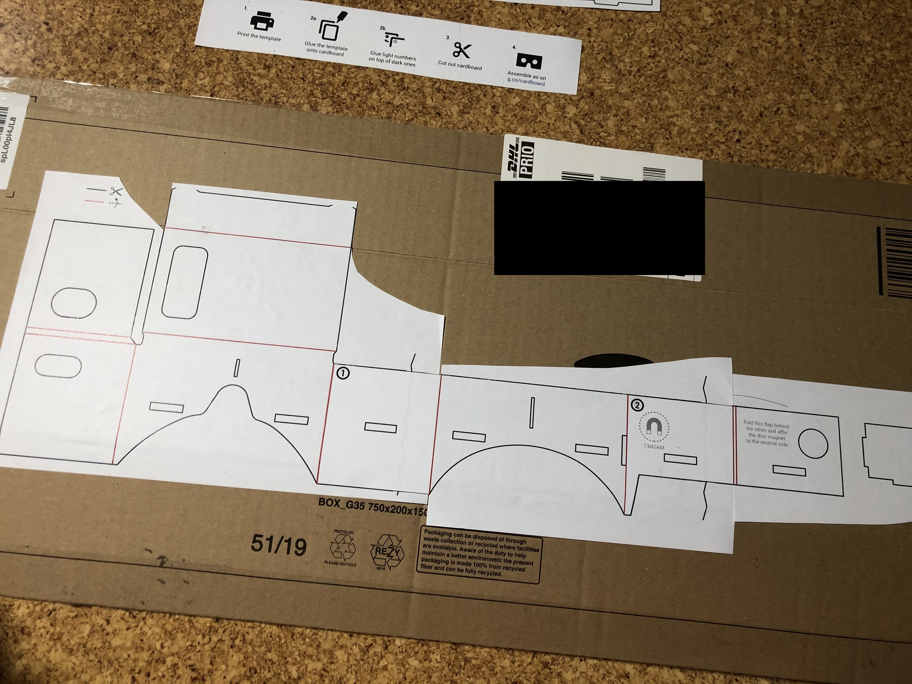

# VR Google Cardboard Zusammenbau

## Ausdrucken der Vorlage

## Grober Zuschnitt

## Aufeinander Kleben der Vorlagen

## Aufkleben auf einen Alten Versandkarton

## Ausschneiden der Langen geraden Kanten mit einer Schere

## Ausschneiden der filigranen Bereiche mit einem Skalpell

## Einschneiden des Kartons an den Faltkanten

## Ausschneiden des Linsenhalters mittels einem Skalpells

## Fertiggestellte Brille und "Überflüssige" Teile des Gehäuses

## Final Thoughts
Um einen guten Sitz der Konstruktion zu bekommen musste ich 2 Teile des Gehäuses entfernen. Dies führe ich auf den verwendeten Karton zurück, da dieser relativ dick war (Versandkarton). Letztlich konnte alles zusammengesteckt werden Abgesehen von einer kante des Gehäuses, welche ich mit Gewebeklebeband fixierte.