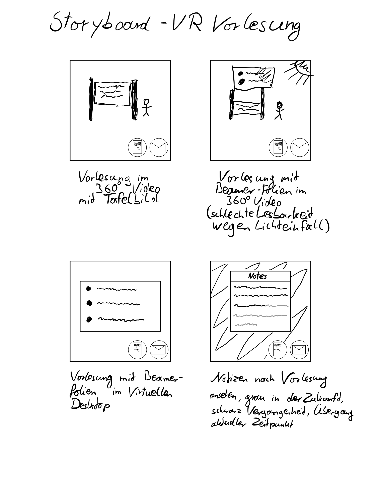
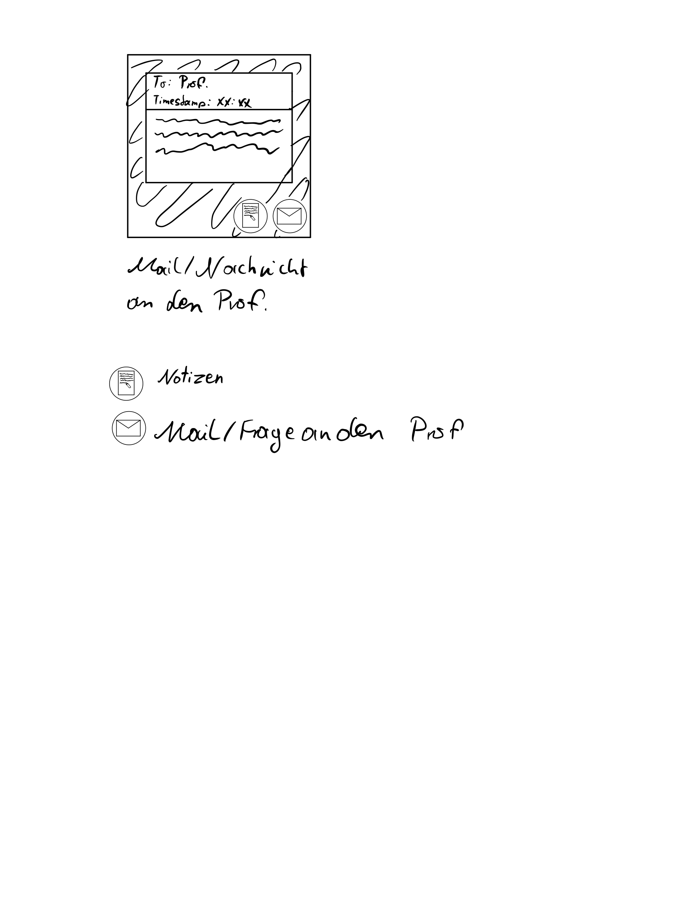

# VR Vorlesung Storyboard sowie Video-Prototyp

## Gedanken zum Storyboard:
* Möglichkeit bei Vorlesungen mit "Beamer-Folien" in eine virtuelle Desktop Ansicht zu wechseln wenn im 360° wengen z.B. Lichteinfall schlechte Sicht besteht. Hierbei läuft der Ton Syncron weiter und auch anmerkungen oder Hervorhebungen des Profs. werden mit angezeigt.
* Fragen und Mails an den Prof zur Vorlesung mit Automatischem Timestamp der VL um besseres bzw. genauers Feedback geben zu können.
* Möglichkeit für Notizen welche mit der Zeit zu der sie in der VL Verfasst wurden gekoppelt sind.

## Storyboard:

## Video-Prototyp:
<video controls width="100%"> 
    <source src="./media/vr_vid.mp4" type="video/mp4"> 
    <a href="./media/vr_vid.mp4">Zum Video</a>
</video>