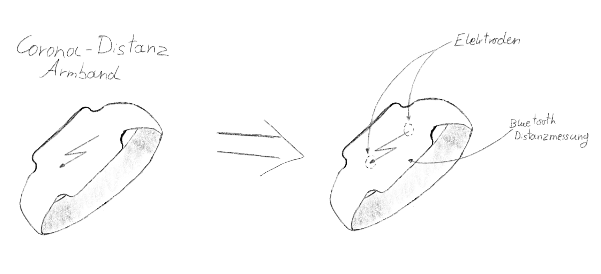

# Entwurf für ein Armband zur Einhaltung der COVID-19 Abstandsvorschriften

## Ideenbeschreibung
Der Entwurf stellt ein Armband zur Einhaltung der COVID-19 Abstandsregelungen dar. Dies Soll erreicht werden durch eine Abstandsmessung mittels Bluetooth 5.0 und der "Information" an den Träger mittels eines sanften Elektroschocks. Zusätzlich bekommt der Nutzer eine Benachrichtigung auf sein Handy im Stil der "Corona App" der Bundesregierung.

## Skizze

## Demovideo eines virtuellen Arduino Prototypen
In diesem Prototypen ist die Abstandsmessung mittels Bluetooth durch einen Ultraschall Sensor ersetzt worden. Des weiteren wird der "Schock" durch eine LED dargestellt welche später durch ein Relais und der dazugehörigen HV Schaltung ersetzt werden kann.
<video controls width="100%"> 
    <source src="./media/corona_bracelet_vid.mp4" type="video/mp4"> 
    <a href="./media/corona_bracelet_vid.mp4">Zum Video</a>
</video>