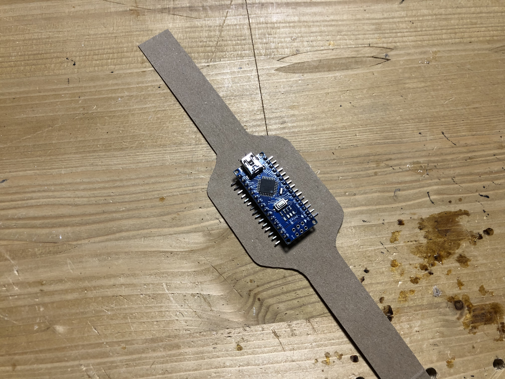

# Endabgabe - COVID-19 Distancing Bracelet

## 0. Ausgangskonzept
Link zur IOT Abgabe. 
[TASK 10 | COVID-19 Abstandsarmband](https://paradoxmike.github.io/IFD-SoSe20/task10_corona-bracelet/)

## 1. Customer Journey Map
Darstellung der Interaktion des Kunden mit dem Produkt.

### 1.1 Kurze Charakterisierung der Nutzergruppe
Als Nutzergruppe des COVID-19 Abstandsarmbands wurden angehörige der Hochschule sowie die Studierenden ausgewählt. Das Armband soll allen sich in der Hochschule aufhaltenden Personen dabei helfen den Sicherheitsabstand von 1,5m einzuhalten und zu informieren wenn dieser unterschritten wurde, sowie zu welcher Person er dies wurde.

### 1.2 Customer Journey aufgeteilt in Punkte/Schritte

1. Wunsch die Räumlichkeiten der Hochschule wieder zu nutzen, sowohl für Präsenzveranstaltungen als auch für Projektzwecke.

2. Die Hochschule stellt als Bedingung zur Nutzung der Räumlichkeiten die Auflage ein COVID-19 Abstandsarmband zu tragen.

3. Innerhalb einer Vorlesungssituation bzw. an deren Ende, beim Verlassen des Raumes, es zu einer Annäherung an den Mindestabstand kommt —> der Träger wird durch einen „Schock“ gewarnt.

4. Nach der Pause bzw. zu beginn der Nächsten Vorlesung kommt es zu einer Unterschreitung des Mindestabstandes —> der Träger wird durch einen „Schock“ gewarnt und erhält eine Benachrichtigung.

## 2. Empirischer Nutzertest
### 2.1 Testablauf
Virtuelles Interview über eine Videochatplatform mit vorheriger, 10 minütiger Einführung in die Idee / das Produkt um Klärung eventueller Verständnisfragen. Anschließendes durchgehen der Nachfolgenden Fragen, sowie allgemeines Q&A und Zeit zum äußern allgemeiner Gedanken.

### 2.2 Fragen
1. Was ist ihre grundlegende Einstellung gegenüber eines COVID-19 Abstandsarmbandes?

2. Würden sie es tragen um die Räumlichkeiten der Hochschule wieder nutzen zu können? Wenn nein wieso und wie könnte sich diese Einstellung ändern?

3. Haben sie Angst vor Elektroschocks?

4. Besitzen sie ein Smartphone und ist auf diesem die Corona App installiert?

5. Welche allgemeinen Gedanken haben sie noch zum COVID-19 Abstandsarmband?

### 2.3 Antworten
#### Proband Eins
1. "Gute Idee, da Leute dazu tendieren zu vergessen den Abstand nicht zu unterschreiten."

2. "Ja klar. Schadet ja an sich nicht und erinnert gut. Man lernt so sicher schnell."

3. "Solange sie nicht in der Größenordnung eines Weidezauns sind sicher nicht."

4. "Ja und nein."

5. "Wohl die beste Möglichkeit Menschen immer daran zu erinnern sich an die Regeln zu halten. Man könnte sich ein wenig wie ein Hund vorkommen. Ich kann mir vorstellen anderen mit dem Arm in den Sicherheitsabstand zu fassen um sie zu ärgern. Wär bestimmt ein witziges Spielchen. Ich wäre sicher nicht der Einzige mit der Idee. Wie zuverlässig ist die Technik und muss ich aus der Uni sobald etwas nicht richtig funktioniert?"

#### Proband Zwei
1. "Ansich eine Gute Idee um mehr Leute dazu zu bringen, jedoch an vielen Orten (wie z.B: Gänge in Supermärkten) wird diese 1,50m Regel oftmals aus versehen gebrochen. Das Armband würde SEHR oft zünden, selbst für Leute die aufpassen, da sich andere Leute nicht dran halten."

2. "Eine gute Idee, vor allem da eine Hochschule generell noch genug Platz bietet um die Abstandsregeln auch 100% einzuhalten, zumindest mehr als ein Supermarkt Korridor. (und es nicht zu nervigen aus versehenden Aktivierungen kommt), es könnte Leute zum Umdenken bringen."

3. "Soweit es schwach genug ist nein."

4. "Ja und Ja."

5. "Eine sehr gute & lustige Idee, für extra Lacher & Regeleinhaltung würde ich vorschlagen, den Schock stärker zu machen wenn man sich in offensichtlich offenen & vermeidbaren Orten aufhält, damit sich jeder daran hält."

#### Proband Drei
1. "Generell eine gute Idee um konstant an das Abstandhalten erinnert zu werden. Aber bei Vorlesungen lässt sich bei normaler Teilnehmeranzahl denke ich keine 2m Abstand halten und dann wäre das etwas hinderlich, außer die Teilnehmeranzahl in Vorlesungen begrenzt werden. Außerdem wäre es nervig in Situationen, wo nur der Arm den Abstand unterschreitet, zb beim Übergeben von Gegenständen und allgemein in Notfallsituationen wäre es sehr hinderlich, je nachdem wie stark dieser Schock dann ist. Ggnnerell würde ich einen einfachen Signalton präferieren"

2. "Also wenn dies die Voraussetzung wäre, auf jeden Fall"

3. "Ja"

4. "Ja und Ja"

5. "Eigentlich wie in Punkt 1 schon erwähnt, glaube ich ein Schock wäre ziemlich unpraktisch und würde auch viele vom Tragen abhalten, aber mit einem Signalton fände ich das Ganze eigentlich ne sehr gute Regelung. Praktisch wäre auch wenn dieses Armband automatisch mit der Corona App verbunden ist und interagiert."

#### Proband Vier
1. "Grundlegend eine gute und spannende Idee da man ständig beobachten kann wie der vorgeschriebene Mindestabstand unterschritten wird. Sei dies jetzt absichtlich oder unabsichtlich. Wenn die Menschen generell bzw. Ständig daran erinnert würden das sie diesen unterschreiten könnte dies zu einer Besserung führen."

2. "Ja, allerdings würde ich die Räumlichkeiten der Hochschule nur für notwendige zwecke betreten, beispielsweise um Einrichtungen wie Computerräume oder ähnliches zu nutzen um an Projekten zu Arbeiten."

3. "Das kommt ganz darauf an wie man das definiert. Wenn sich die Intensität irgendwo unter Weidezaun bei eine Gewischt bekommen beim anfassen einer Türklinke hält, nachdem man mit Wollsocken über einen Teppich gelaufen ist dann nicht. Stärkere Schläge währen jedoch furchteinflößend."

4. "Ja und Nein."

5. "Ich halte es für eine durchaus durchführbare Idee zum Schutz von sich selbst und den Kommilitonen, jedoch bezweifle ich das dadurch wieder Präsenzunterricht möglich wird. Zumindest würde ich selbst dennoch nicht an Präsenzveranstaltungen teilnehmen wollen da mir das Risiko bei derartigen Menschenansammlungen immer noch zu hoch ist."

### 2.4 Findings
* Schock sollte geringer als der eines Weidezauns.
* Probanden besitzen Smartphones, jedoch nutzt nur die Hälfte die „Corona App“.
* Möglicher Missbrach um Andere zu ärgern.
* Unsicherheit über technische Zuverlässigkeit.
* Zufälliges oder versehentliches anschlagen des Armbandes, vor allem in Situationen in denen ein Part nichts für die Unterschreitung kann. Zum Beispiel eine Engstelle auf dem gang wenn eine Person nicht wartet.
* Möglicherweise Verstärkung des Schocks in Situationen in denen ein Unterschreiten des Mindestabstandes sehr einfach zu vermeiden gewesen währe, zum Beispiel ein offener Platz oder breiter Gang.
* Für Vorlesungen oder Präsenzveranstaltungen eher ungeeignet durch die hohe Teilnehmerdichte.
* Alternative Warnmethode zum Schock.
* Eventuell Integration in die „Corona App“

### 2.5 Top-Findings
* Schockstärke muss gering genug sein
* Alternative Warnmethode zum Schock
* App-Integration

## 3. Prototyp Enhancement
### 3.1 Verbesserungspunkte
1. Schockstärke im Bereich eine Piezoelements (elektrisches Feuerzeug)
2. Alternative Warnmethode zum Schock, Ton, Vibration oder Lichtsignal
3. Integration in eine App, Möglicherweise die "Corona App"

### 3.2 Prototypenbau Armband
#### 1. Maßnehmen am Handgelenk

#### 2. Aufzeichen und ausschneiden eines Armbandes auf Karton

#### 3. Einpassen des Arduinos

#### 4. Aufkleben und Verlöten der LEDs

#### 5. Verlöten der LEDs mit dem Arduinos

#### 6. Verkleben des Arduinos

#### 7. Funktionstest mit Example-Code
<video controls width="100%"> 
    <source src="./media/prototype_07.mp4" type="video/mp4"> 
    <a href="./media/prototype_07.mp4">Zum Video</a>
</video>

#### 8. Codeing

Quellcode:
`
#include <Adafruit_NeoPixel.h>

#define PIN 2           //pin on which the LED-Data line is connected
#define NUMLEDS 6     //How many LEDs are attached

Adafruit_NeoPixel leds(NUMLEDS, PIN, NEO_GRB + NEO_KHZ800);

bool first = true;

void setup() {
    leds.begin(); // INITIALIZE
}

void loop() {
    if (first == true) {
        for(int i=0; i<NUMLEDS; i++) {
            leds.setPixelColor(i, leds.Color(255,140,0));
        }
        leds.show();
        delay(2000);
        for(int i=0; i<NUMLEDS; i++) {
            leds.setPixelColor(i, leds.Color(255, 0, 0));
        }
        leds.show();
        delay(6000);
        for(int i=0; i<NUMLEDS; i++) {
            leds.setPixelColor(i, leds.Color(0, 255, 0));
        }
        leds.show();
    }
    first = false;
}
`
